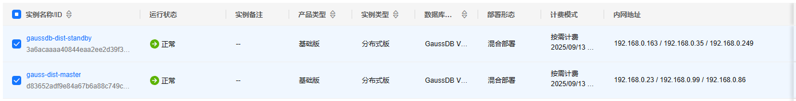
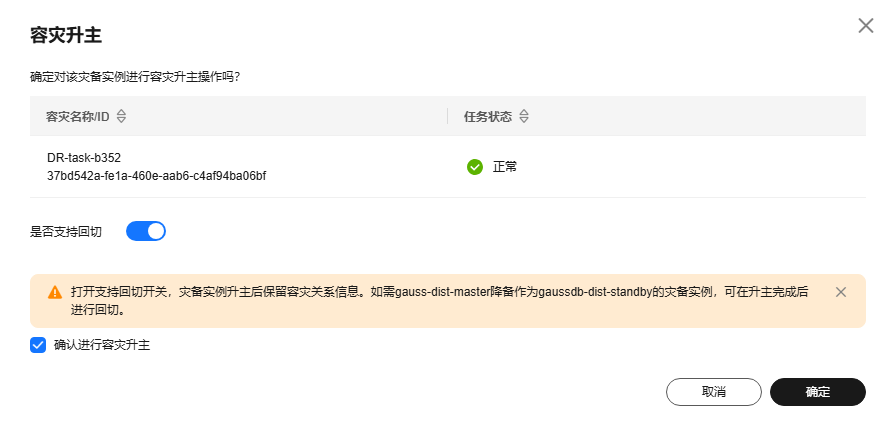

# GaussDB负载均衡使用示例

## 分布式场景

## 一套分布式集群

集群信息如下：


请求均衡分布在各个CN节点。

运行程序

```bash
export  DSN="dbname=postgres user=root password=YourPasswd host=192.168.0.86,192.168.0.99,192.168.0.23 port=8000,8000,8000"
python cluster_ha_showcase.py "$DSN"
```

**运行结果**

```bash
=== 容灾场景测试 ===
2025-09-13 11:45:54,582 - INFO - 连接成功: host=192.168.0.86 port=8000 user=*** password=*** dbname=postgres，耗时: 0.04 秒
2025-09-13 11:45:54,591 - WARNING - 未找到匹配的 node_host: 192.168.0.86，返回 coordinator
容灾测试通过: 连接到节点 192.168.0.86:8000，角色: coordinator，模式: distributed

=== 容灾场景测试（模拟主节点故障） ===
2025-09-13 11:45:54,626 - INFO - 连接成功: host=192.168.0.99 port=8000 user=*** password=*** dbname=postgres，耗时: 0.03 秒
2025-09-13 11:45:54,633 - WARNING - 未找到匹配的 node_host: 192.168.0.99，返回 coordinator
容灾测试通过: 连接到节点 192.168.0.99:8000，角色: coordinator，模式: distributed

=== 负载均衡场景测试 ===
2025-09-13 11:45:54,666 - INFO - 连接成功: host=192.168.0.86 port=8000 user=*** password=*** dbname=postgres，耗时: 0.03 秒
2025-09-13 11:45:54,674 - WARNING - 未找到匹配的 node_host: 192.168.0.86，返回 coordinator
2025-09-13 11:45:54,674 - INFO - 检查节点 192.168.0.86:8000，角色: coordinator，模式: distributed
2025-09-13 11:45:54,707 - INFO - 连接成功: host=192.168.0.86 port=8000 user=*** password=*** dbname=postgres，耗时: 0.03 秒
写操作成功: 主节点 192.168.0.86:8000，角色: coordinator

=== 测试 disable 模式 ===
2025-09-13 11:45:55,848 - INFO - 连接成功: host=192.168.0.86 port=8000 user=*** password=*** dbname=postgres，耗时: 0.04 秒
2025-09-13 11:45:55,853 - WARNING - 未找到匹配的 node_host: 192.168.0.86，返回 coordinator
2025-09-13 11:45:55,857 - INFO - 读操作结果: ('test write',)
读操作成功: 连接到节点 192.168.0.86:8000，角色: coordinator，数据: test write
2025-09-13 11:45:55,900 - INFO - 连接成功: host=192.168.0.86 port=8000 user=*** password=*** dbname=postgres，耗时: 0.04 秒
2025-09-13 11:45:55,905 - WARNING - 未找到匹配的 node_host: 192.168.0.86，返回 coordinator
2025-09-13 11:45:55,908 - INFO - 读操作结果: ('test write',)
读操作成功: 连接到节点 192.168.0.86:8000，角色: coordinator，数据: test write
2025-09-13 11:45:55,940 - INFO - 连接成功: host=192.168.0.86 port=8000 user=*** password=*** dbname=postgres，耗时: 0.03 秒
2025-09-13 11:45:55,945 - WARNING - 未找到匹配的 node_host: 192.168.0.86，返回 coordinator
2025-09-13 11:45:55,948 - INFO - 读操作结果: ('test write',)
读操作成功: 连接到节点 192.168.0.86:8000，角色: coordinator，数据: test write
2025-09-13 11:45:55,980 - INFO - 连接成功: host=192.168.0.86 port=8000 user=*** password=*** dbname=postgres，耗时: 0.03 秒
2025-09-13 11:45:55,984 - WARNING - 未找到匹配的 node_host: 192.168.0.86，返回 coordinator
2025-09-13 11:45:55,987 - INFO - 读操作结果: ('test write',)
读操作成功: 连接到节点 192.168.0.86:8000，角色: coordinator，数据: test write
2025-09-13 11:45:56,018 - INFO - 连接成功: host=192.168.0.86 port=8000 user=*** password=*** dbname=postgres，耗时: 0.03 秒
2025-09-13 11:45:56,022 - WARNING - 未找到匹配的 node_host: 192.168.0.86，返回 coordinator
2025-09-13 11:45:56,026 - INFO - 读操作结果: ('test write',)
读操作成功: 连接到节点 192.168.0.86:8000，角色: coordinator，数据: test write
2025-09-13 11:45:56,057 - INFO - 连接成功: host=192.168.0.86 port=8000 user=*** password=*** dbname=postgres，耗时: 0.03 秒
2025-09-13 11:45:56,062 - WARNING - 未找到匹配的 node_host: 192.168.0.86，返回 coordinator
2025-09-13 11:45:56,065 - INFO - 读操作结果: ('test write',)
读操作成功: 连接到节点 192.168.0.86:8000，角色: coordinator，数据: test write
2025-09-13 11:45:56,095 - INFO - 连接成功: host=192.168.0.86 port=8000 user=*** password=*** dbname=postgres，耗时: 0.03 秒
2025-09-13 11:45:56,099 - WARNING - 未找到匹配的 node_host: 192.168.0.86，返回 coordinator
2025-09-13 11:45:56,102 - INFO - 读操作结果: ('test write',)
读操作成功: 连接到节点 192.168.0.86:8000，角色: coordinator，数据: test write
2025-09-13 11:45:56,134 - INFO - 连接成功: host=192.168.0.86 port=8000 user=*** password=*** dbname=postgres，耗时: 0.03 秒
2025-09-13 11:45:56,138 - WARNING - 未找到匹配的 node_host: 192.168.0.86，返回 coordinator
2025-09-13 11:45:56,141 - INFO - 读操作结果: ('test write',)
读操作成功: 连接到节点 192.168.0.86:8000，角色: coordinator，数据: test write
2025-09-13 11:45:56,174 - INFO - 连接成功: host=192.168.0.86 port=8000 user=*** password=*** dbname=postgres，耗时: 0.03 秒
2025-09-13 11:45:56,178 - WARNING - 未找到匹配的 node_host: 192.168.0.86，返回 coordinator
2025-09-13 11:45:56,181 - INFO - 读操作结果: ('test write',)
读操作成功: 连接到节点 192.168.0.86:8000，角色: coordinator，数据: test write
2025-09-13 11:45:56,213 - INFO - 连接成功: host=192.168.0.86 port=8000 user=*** password=*** dbname=postgres，耗时: 0.03 秒
2025-09-13 11:45:56,217 - WARNING - 未找到匹配的 node_host: 192.168.0.86，返回 coordinator
2025-09-13 11:45:56,220 - INFO - 读操作结果: ('test write',)
读操作成功: 连接到节点 192.168.0.86:8000，角色: coordinator，数据: test write
2025-09-13 11:45:56,251 - INFO - 连接成功: host=192.168.0.86 port=8000 user=*** password=*** dbname=postgres，耗时: 0.03 秒
2025-09-13 11:45:56,255 - WARNING - 未找到匹配的 node_host: 192.168.0.86，返回 coordinator
2025-09-13 11:45:56,258 - INFO - 读操作结果: ('test write',)
读操作成功: 连接到节点 192.168.0.86:8000，角色: coordinator，数据: test write
2025-09-13 11:45:56,290 - INFO - 连接成功: host=192.168.0.86 port=8000 user=*** password=*** dbname=postgres，耗时: 0.03 秒
2025-09-13 11:45:56,294 - WARNING - 未找到匹配的 node_host: 192.168.0.86，返回 coordinator
2025-09-13 11:45:56,297 - INFO - 读操作结果: ('test write',)
读操作成功: 连接到节点 192.168.0.86:8000，角色: coordinator，数据: test write
2025-09-13 11:45:56,327 - INFO - 连接成功: host=192.168.0.86 port=8000 user=*** password=*** dbname=postgres，耗时: 0.03 秒
2025-09-13 11:45:56,331 - WARNING - 未找到匹配的 node_host: 192.168.0.86，返回 coordinator
2025-09-13 11:45:56,334 - INFO - 读操作结果: ('test write',)
读操作成功: 连接到节点 192.168.0.86:8000，角色: coordinator，数据: test write
2025-09-13 11:45:56,365 - INFO - 连接成功: host=192.168.0.86 port=8000 user=*** password=*** dbname=postgres，耗时: 0.03 秒
2025-09-13 11:45:56,369 - WARNING - 未找到匹配的 node_host: 192.168.0.86，返回 coordinator
2025-09-13 11:45:56,372 - INFO - 读操作结果: ('test write',)
读操作成功: 连接到节点 192.168.0.86:8000，角色: coordinator，数据: test write
2025-09-13 11:45:56,404 - INFO - 连接成功: host=192.168.0.86 port=8000 user=*** password=*** dbname=postgres，耗时: 0.03 秒
2025-09-13 11:45:56,408 - WARNING - 未找到匹配的 node_host: 192.168.0.86，返回 coordinator
2025-09-13 11:45:56,411 - INFO - 读操作结果: ('test write',)
读操作成功: 连接到节点 192.168.0.86:8000，角色: coordinator，数据: test write
2025-09-13 11:45:56,442 - INFO - 连接成功: host=192.168.0.86 port=8000 user=*** password=*** dbname=postgres，耗时: 0.03 秒
2025-09-13 11:45:56,446 - WARNING - 未找到匹配的 node_host: 192.168.0.86，返回 coordinator
2025-09-13 11:45:56,449 - INFO - 读操作结果: ('test write',)
读操作成功: 连接到节点 192.168.0.86:8000，角色: coordinator，数据: test write
2025-09-13 11:45:56,479 - INFO - 连接成功: host=192.168.0.86 port=8000 user=*** password=*** dbname=postgres，耗时: 0.03 秒
2025-09-13 11:45:56,483 - WARNING - 未找到匹配的 node_host: 192.168.0.86，返回 coordinator
2025-09-13 11:45:56,485 - INFO - 读操作结果: ('test write',)
读操作成功: 连接到节点 192.168.0.86:8000，角色: coordinator，数据: test write
2025-09-13 11:45:56,516 - INFO - 连接成功: host=192.168.0.86 port=8000 user=*** password=*** dbname=postgres，耗时: 0.03 秒
2025-09-13 11:45:56,520 - WARNING - 未找到匹配的 node_host: 192.168.0.86，返回 coordinator
2025-09-13 11:45:56,523 - INFO - 读操作结果: ('test write',)
读操作成功: 连接到节点 192.168.0.86:8000，角色: coordinator，数据: test write
2025-09-13 11:45:56,553 - INFO - 连接成功: host=192.168.0.86 port=8000 user=*** password=*** dbname=postgres，耗时: 0.03 秒
2025-09-13 11:45:56,557 - WARNING - 未找到匹配的 node_host: 192.168.0.86，返回 coordinator
2025-09-13 11:45:56,559 - INFO - 读操作结果: ('test write',)
读操作成功: 连接到节点 192.168.0.86:8000，角色: coordinator，数据: test write
2025-09-13 11:45:56,590 - INFO - 连接成功: host=192.168.0.86 port=8000 user=*** password=*** dbname=postgres，耗时: 0.03 秒
2025-09-13 11:45:56,594 - WARNING - 未找到匹配的 node_host: 192.168.0.86，返回 coordinator
2025-09-13 11:45:56,597 - INFO - 读操作结果: ('test write',)
读操作成功: 连接到节点 192.168.0.86:8000，角色: coordinator，数据: test write
负载均衡测试通过 (disable 模式): 连接顺序符合预期 ['192.168.0.86', '192.168.0.86', '192.168.0.86', '192.168.0.86', '192.168.0.86', '192.168.0.86', '192.168.0.86', '192.168.0.86', '192.168.0.86', '192.168.0.86', '192.168.0.86', '192.168.0.86', '192.168.0.86', '192.168.0.86', '192.168.0.86', '192.168.0.86', '192.168.0.86', '192.168.0.86', '192.168.0.86', '192.168.0.86']

=== 测试 random 模式 ===
2025-09-13 11:45:56,628 - INFO - 连接成功: host=192.168.0.86 port=8000 user=*** password=*** dbname=postgres，耗时: 0.03 秒
2025-09-13 11:45:56,633 - WARNING - 未找到匹配的 node_host: 192.168.0.86，返回 coordinator
2025-09-13 11:45:56,636 - INFO - 读操作结果: ('test write',)
读操作成功: 连接到节点 192.168.0.86:8000，角色: coordinator，数据: test write
2025-09-13 11:45:56,668 - INFO - 连接成功: host=192.168.0.99 port=8000 user=*** password=*** dbname=postgres，耗时: 0.03 秒
2025-09-13 11:45:56,672 - WARNING - 未找到匹配的 node_host: 192.168.0.99，返回 coordinator
2025-09-13 11:45:56,677 - INFO - 读操作结果: ('test write',)
读操作成功: 连接到节点 192.168.0.99:8000，角色: coordinator，数据: test write
2025-09-13 11:45:56,712 - INFO - 连接成功: host=192.168.0.23 port=8000 user=*** password=*** dbname=postgres，耗时: 0.03 秒
2025-09-13 11:45:56,717 - WARNING - 未找到匹配的 node_host: 192.168.0.23，返回 coordinator
2025-09-13 11:45:56,723 - INFO - 读操作结果: ('test write',)
读操作成功: 连接到节点 192.168.0.23:8000，角色: coordinator，数据: test write
2025-09-13 11:45:56,757 - INFO - 连接成功: host=192.168.0.86 port=8000 user=*** password=*** dbname=postgres，耗时: 0.03 秒
2025-09-13 11:45:56,761 - WARNING - 未找到匹配的 node_host: 192.168.0.86，返回 coordinator
2025-09-13 11:45:56,764 - INFO - 读操作结果: ('test write',)
读操作成功: 连接到节点 192.168.0.86:8000，角色: coordinator，数据: test write
负载均衡测试通过 (random 模式): 随机连接，包含多个节点 ['192.168.0.86', '192.168.0.99', '192.168.0.23', '192.168.0.86']
2025-09-13 11:45:56,795 - INFO - 连接成功: host=192.168.0.86 port=8000 user=*** password=*** dbname=postgres，耗时: 0.03 秒

=== 自动寻主场景测试 ===
2025-09-13 11:45:56,865 - INFO - 连接成功: host=192.168.0.86 port=8000 user=*** password=*** dbname=postgres，耗时: 0.04 秒
2025-09-13 11:45:56,873 - WARNING - 未找到匹配的 node_host: 192.168.0.86，返回 coordinator
自动寻主测试通过: 连接到协调节点 192.168.0.86:8000，角色: coordinator

=== 自动寻主场景测试（模拟主节点故障） ===
2025-09-13 11:45:56,908 - INFO - 连接成功: host=192.168.0.99 port=8000 user=*** password=*** dbname=postgres，耗时: 0.03 秒
2025-09-13 11:45:56,915 - WARNING - 未找到匹配的 node_host: 192.168.0.99，返回 coordinator
自动寻主测试通过: 连接到协调节点 192.168.0.99:8000，角色: coordinator
```


## 两套套分布式集群做容灾

创建两个分布式版实例，示例集群在同一VPC的同一子网，如果在不同VPC，需要打通网络。主实例与灾备实例的副本一致性协议、引擎内核版本需要一致。



在“实例管理->对应实例基本信息->网络信息->子网”获取子网信息。


登录主实例，单击“实例管理->对应实例基本信息->配置信息->容灾IP->重置配置”，并相互配置对端实例子网段信息。


登录灾备实例，单击“实例管理->对应实例基本信息->配置信息->容灾IP->重置配置”，并相互配置对端实例子网段信息。


获取灾备实例的容灾IP
192.168.0.171


在页面左上角单击，选择“数据库 > 云数据库 GaussDB”，进入云数据库 GaussDB信息页面。

单击左侧导航栏的“容灾管理”，在页面右上方单击“创建容灾任务”。


单击“确定”开始搭建容灾关系，可在“容灾管理”页面查看任务状态。


当出现 RPO: 0 s   RTO: 0 s，说明容灾任务OK，继续下面的示例操作。


### 主集群和备集群正常

运行程序

```bash
export  DSN="dbname=postgres user=root password=YourPasswd host=192.168.0.86,192.168.0.99,192.168.0.23,192.168.0.249,192.168.0.35,192.168.0.163 port=8000,8000,8000,8000,8000,8000"
python cluster_ha_showcase.py "$DSN"
```

**运行结果**

```bash
=== 容灾场景测试 ===
2025-09-13 12:16:42,033 - INFO - 连接成功: host=192.168.0.86 port=8000 user=*** password=*** dbname=postgres，耗时: 0.03 秒
2025-09-13 12:16:42,042 - WARNING - 未找到匹配的 node_host: 192.168.0.86，返回 coordinator
容灾测试通过: 连接到节点 192.168.0.86:8000，角色: coordinator，模式: distributed

=== 容灾场景测试（模拟主节点故障） ===
2025-09-13 12:16:42,074 - INFO - 连接成功: host=192.168.0.99 port=8000 user=*** password=*** dbname=postgres，耗时: 0.03 秒
2025-09-13 12:16:42,081 - WARNING - 未找到匹配的 node_host: 192.168.0.99，返回 coordinator
容灾测试通过: 连接到节点 192.168.0.99:8000，角色: coordinator，模式: distributed

=== 负载均衡场景测试 ===
2025-09-13 12:16:42,112 - INFO - 连接成功: host=192.168.0.86 port=8000 user=*** password=*** dbname=postgres，耗时: 0.03 秒
2025-09-13 12:16:42,120 - WARNING - 未找到匹配的 node_host: 192.168.0.86，返回 coordinator
2025-09-13 12:16:42,120 - INFO - 检查节点 192.168.0.86:8000，角色: coordinator，模式: distributed
2025-09-13 12:16:42,152 - INFO - 连接成功: host=192.168.0.86 port=8000 user=*** password=*** dbname=postgres，耗时: 0.03 秒
写操作成功: 主节点 192.168.0.86:8000，角色: coordinator

=== 测试 disable 模式 ===
2025-09-13 12:16:43,262 - INFO - 连接成功: host=192.168.0.86 port=8000 user=*** password=*** dbname=postgres，耗时: 0.03 秒
2025-09-13 12:16:43,266 - WARNING - 未找到匹配的 node_host: 192.168.0.86，返回 coordinator
2025-09-13 12:16:43,270 - INFO - 读操作结果: ('test write',)
读操作成功: 连接到节点 192.168.0.86:8000，角色: coordinator，数据: test write
2025-09-13 12:16:43,301 - INFO - 连接成功: host=192.168.0.86 port=8000 user=*** password=*** dbname=postgres，耗时: 0.03 秒
2025-09-13 12:16:43,306 - WARNING - 未找到匹配的 node_host: 192.168.0.86，返回 coordinator
2025-09-13 12:16:43,308 - INFO - 读操作结果: ('test write',)
读操作成功: 连接到节点 192.168.0.86:8000，角色: coordinator，数据: test write
2025-09-13 12:16:43,340 - INFO - 连接成功: host=192.168.0.86 port=8000 user=*** password=*** dbname=postgres，耗时: 0.03 秒
2025-09-13 12:16:43,344 - WARNING - 未找到匹配的 node_host: 192.168.0.86，返回 coordinator
2025-09-13 12:16:43,347 - INFO - 读操作结果: ('test write',)
读操作成功: 连接到节点 192.168.0.86:8000，角色: coordinator，数据: test write
2025-09-13 12:16:43,378 - INFO - 连接成功: host=192.168.0.86 port=8000 user=*** password=*** dbname=postgres，耗时: 0.03 秒
2025-09-13 12:16:43,383 - WARNING - 未找到匹配的 node_host: 192.168.0.86，返回 coordinator
2025-09-13 12:16:43,385 - INFO - 读操作结果: ('test write',)
读操作成功: 连接到节点 192.168.0.86:8000，角色: coordinator，数据: test write
2025-09-13 12:16:43,418 - INFO - 连接成功: host=192.168.0.86 port=8000 user=*** password=*** dbname=postgres，耗时: 0.03 秒
2025-09-13 12:16:43,422 - WARNING - 未找到匹配的 node_host: 192.168.0.86，返回 coordinator
2025-09-13 12:16:43,426 - INFO - 读操作结果: ('test write',)
读操作成功: 连接到节点 192.168.0.86:8000，角色: coordinator，数据: test write
2025-09-13 12:16:43,456 - INFO - 连接成功: host=192.168.0.86 port=8000 user=*** password=*** dbname=postgres，耗时: 0.03 秒
2025-09-13 12:16:43,460 - WARNING - 未找到匹配的 node_host: 192.168.0.86，返回 coordinator
2025-09-13 12:16:43,462 - INFO - 读操作结果: ('test write',)
读操作成功: 连接到节点 192.168.0.86:8000，角色: coordinator，数据: test write
2025-09-13 12:16:43,494 - INFO - 连接成功: host=192.168.0.86 port=8000 user=*** password=*** dbname=postgres，耗时: 0.03 秒
2025-09-13 12:16:43,499 - WARNING - 未找到匹配的 node_host: 192.168.0.86，返回 coordinator
2025-09-13 12:16:43,502 - INFO - 读操作结果: ('test write',)
读操作成功: 连接到节点 192.168.0.86:8000，角色: coordinator，数据: test write
2025-09-13 12:16:43,533 - INFO - 连接成功: host=192.168.0.86 port=8000 user=*** password=*** dbname=postgres，耗时: 0.03 秒
2025-09-13 12:16:43,538 - WARNING - 未找到匹配的 node_host: 192.168.0.86，返回 coordinator
2025-09-13 12:16:43,541 - INFO - 读操作结果: ('test write',)
读操作成功: 连接到节点 192.168.0.86:8000，角色: coordinator，数据: test write
2025-09-13 12:16:43,573 - INFO - 连接成功: host=192.168.0.86 port=8000 user=*** password=*** dbname=postgres，耗时: 0.03 秒
2025-09-13 12:16:43,578 - WARNING - 未找到匹配的 node_host: 192.168.0.86，返回 coordinator
2025-09-13 12:16:43,581 - INFO - 读操作结果: ('test write',)
读操作成功: 连接到节点 192.168.0.86:8000，角色: coordinator，数据: test write
2025-09-13 12:16:43,615 - INFO - 连接成功: host=192.168.0.86 port=8000 user=*** password=*** dbname=postgres，耗时: 0.03 秒
2025-09-13 12:16:43,620 - WARNING - 未找到匹配的 node_host: 192.168.0.86，返回 coordinator
2025-09-13 12:16:43,623 - INFO - 读操作结果: ('test write',)
读操作成功: 连接到节点 192.168.0.86:8000，角色: coordinator，数据: test write
2025-09-13 12:16:43,658 - INFO - 连接成功: host=192.168.0.86 port=8000 user=*** password=*** dbname=postgres，耗时: 0.03 秒
2025-09-13 12:16:43,662 - WARNING - 未找到匹配的 node_host: 192.168.0.86，返回 coordinator
2025-09-13 12:16:43,665 - INFO - 读操作结果: ('test write',)
读操作成功: 连接到节点 192.168.0.86:8000，角色: coordinator，数据: test write
2025-09-13 12:16:43,697 - INFO - 连接成功: host=192.168.0.86 port=8000 user=*** password=*** dbname=postgres，耗时: 0.03 秒
2025-09-13 12:16:43,702 - WARNING - 未找到匹配的 node_host: 192.168.0.86，返回 coordinator
2025-09-13 12:16:43,704 - INFO - 读操作结果: ('test write',)
读操作成功: 连接到节点 192.168.0.86:8000，角色: coordinator，数据: test write
2025-09-13 12:16:43,735 - INFO - 连接成功: host=192.168.0.86 port=8000 user=*** password=*** dbname=postgres，耗时: 0.03 秒
2025-09-13 12:16:43,740 - WARNING - 未找到匹配的 node_host: 192.168.0.86，返回 coordinator
2025-09-13 12:16:43,742 - INFO - 读操作结果: ('test write',)
读操作成功: 连接到节点 192.168.0.86:8000，角色: coordinator，数据: test write
2025-09-13 12:16:43,774 - INFO - 连接成功: host=192.168.0.86 port=8000 user=*** password=*** dbname=postgres，耗时: 0.03 秒
2025-09-13 12:16:43,779 - WARNING - 未找到匹配的 node_host: 192.168.0.86，返回 coordinator
2025-09-13 12:16:43,781 - INFO - 读操作结果: ('test write',)
读操作成功: 连接到节点 192.168.0.86:8000，角色: coordinator，数据: test write
2025-09-13 12:16:43,813 - INFO - 连接成功: host=192.168.0.86 port=8000 user=*** password=*** dbname=postgres，耗时: 0.03 秒
2025-09-13 12:16:43,817 - WARNING - 未找到匹配的 node_host: 192.168.0.86，返回 coordinator
2025-09-13 12:16:43,820 - INFO - 读操作结果: ('test write',)
读操作成功: 连接到节点 192.168.0.86:8000，角色: coordinator，数据: test write
2025-09-13 12:16:43,853 - INFO - 连接成功: host=192.168.0.86 port=8000 user=*** password=*** dbname=postgres，耗时: 0.03 秒
2025-09-13 12:16:43,858 - WARNING - 未找到匹配的 node_host: 192.168.0.86，返回 coordinator
2025-09-13 12:16:43,861 - INFO - 读操作结果: ('test write',)
读操作成功: 连接到节点 192.168.0.86:8000，角色: coordinator，数据: test write
2025-09-13 12:16:43,893 - INFO - 连接成功: host=192.168.0.86 port=8000 user=*** password=*** dbname=postgres，耗时: 0.03 秒
2025-09-13 12:16:43,898 - WARNING - 未找到匹配的 node_host: 192.168.0.86，返回 coordinator
2025-09-13 12:16:43,901 - INFO - 读操作结果: ('test write',)
读操作成功: 连接到节点 192.168.0.86:8000，角色: coordinator，数据: test write
2025-09-13 12:16:43,934 - INFO - 连接成功: host=192.168.0.86 port=8000 user=*** password=*** dbname=postgres，耗时: 0.03 秒
2025-09-13 12:16:43,938 - WARNING - 未找到匹配的 node_host: 192.168.0.86，返回 coordinator
2025-09-13 12:16:43,941 - INFO - 读操作结果: ('test write',)
读操作成功: 连接到节点 192.168.0.86:8000，角色: coordinator，数据: test write
2025-09-13 12:16:43,976 - INFO - 连接成功: host=192.168.0.86 port=8000 user=*** password=*** dbname=postgres，耗时: 0.03 秒
2025-09-13 12:16:43,981 - WARNING - 未找到匹配的 node_host: 192.168.0.86，返回 coordinator
2025-09-13 12:16:43,984 - INFO - 读操作结果: ('test write',)
读操作成功: 连接到节点 192.168.0.86:8000，角色: coordinator，数据: test write
2025-09-13 12:16:44,015 - INFO - 连接成功: host=192.168.0.86 port=8000 user=*** password=*** dbname=postgres，耗时: 0.03 秒
2025-09-13 12:16:44,019 - WARNING - 未找到匹配的 node_host: 192.168.0.86，返回 coordinator
2025-09-13 12:16:44,022 - INFO - 读操作结果: ('test write',)
读操作成功: 连接到节点 192.168.0.86:8000，角色: coordinator，数据: test write
负载均衡测试通过 (disable 模式): 连接顺序符合预期 ['192.168.0.86', '192.168.0.86', '192.168.0.86', '192.168.0.86', '192.168.0.86', '192.168.0.86', '192.168.0.86', '192.168.0.86', '192.168.0.86', '192.168.0.86', '192.168.0.86', '192.168.0.86', '192.168.0.86', '192.168.0.86', '192.168.0.86', '192.168.0.86', '192.168.0.86', '192.168.0.86', '192.168.0.86', '192.168.0.86']

=== 测试 random 模式 ===
2025-09-13 12:16:44,054 - INFO - 连接成功: host=192.168.0.86 port=8000 user=*** password=*** dbname=postgres，耗时: 0.03 秒
2025-09-13 12:16:44,059 - WARNING - 未找到匹配的 node_host: 192.168.0.86，返回 coordinator
2025-09-13 12:16:44,062 - INFO - 读操作结果: ('test write',)
读操作成功: 连接到节点 192.168.0.86:8000，角色: coordinator，数据: test write
2025-09-13 12:16:44,099 - INFO - 连接成功: host=192.168.0.35 port=8000 user=*** password=*** dbname=postgres，耗时: 0.04 秒
2025-09-13 12:16:44,104 - WARNING - 未找到匹配的 node_host: 192.168.0.35，返回 coordinator
2025-09-13 12:16:44,107 - ERROR - 读操作失败 (192.168.0.35:8000): relation "test_table" does not exist
LINE 1: SELECT data FROM test_table WHERE id = 1
                         ^
2025-09-13 12:16:44,136 - INFO - 连接成功: host=192.168.0.86 port=8000 user=*** password=*** dbname=postgres，耗时: 0.03 秒
2025-09-13 12:16:44,140 - WARNING - 未找到匹配的 node_host: 192.168.0.86，返回 coordinator
2025-09-13 12:16:44,143 - INFO - 读操作结果: ('test write',)
读操作成功: 连接到节点 192.168.0.86:8000，角色: coordinator，数据: test write
2025-09-13 12:16:44,177 - INFO - 连接成功: host=192.168.0.249 port=8000 user=*** password=*** dbname=postgres，耗时: 0.03 秒
2025-09-13 12:16:44,182 - WARNING - 未找到匹配的 node_host: 192.168.0.249，返回 coordinator
2025-09-13 12:16:44,186 - ERROR - 读操作失败 (192.168.0.249:8000): relation "test_table" does not exist
LINE 1: SELECT data FROM test_table WHERE id = 1
                         ^
2025-09-13 12:16:44,217 - INFO - 连接成功: host=192.168.0.163 port=8000 user=*** password=*** dbname=postgres，耗时: 0.03 秒
2025-09-13 12:16:44,222 - WARNING - 未找到匹配的 node_host: 192.168.0.163，返回 coordinator
2025-09-13 12:16:44,225 - ERROR - 读操作失败 (192.168.0.163:8000): relation "test_table" does not exist
LINE 1: SELECT data FROM test_table WHERE id = 1
                         ^
2025-09-13 12:16:44,256 - INFO - 连接成功: host=192.168.0.99 port=8000 user=*** password=*** dbname=postgres，耗时: 0.03 秒
2025-09-13 12:16:44,261 - WARNING - 未找到匹配的 node_host: 192.168.0.99，返回 coordinator
2025-09-13 12:16:44,266 - INFO - 读操作结果: ('test write',)
读操作成功: 连接到节点 192.168.0.99:8000，角色: coordinator，数据: test write
2025-09-13 12:16:44,298 - INFO - 连接成功: host=192.168.0.23 port=8000 user=*** password=*** dbname=postgres，耗时: 0.03 秒
2025-09-13 12:16:44,303 - WARNING - 未找到匹配的 node_host: 192.168.0.23，返回 coordinator
2025-09-13 12:16:44,309 - INFO - 读操作结果: ('test write',)
读操作成功: 连接到节点 192.168.0.23:8000，角色: coordinator，数据: test write
负载均衡测试通过 (random 模式): 随机连接，包含多个节点 ['192.168.0.86', '192.168.0.86', '192.168.0.99', '192.168.0.23']
警告: 未连接到所有节点，缺失节点: ['192.168.0.249', '192.168.0.35', '192.168.0.163']
警告: 以下节点不可用: ['192.168.0.35:8000', '192.168.0.249:8000', '192.168.0.163:8000']
2025-09-13 12:16:44,342 - INFO - 连接成功: host=192.168.0.86 port=8000 user=*** password=*** dbname=postgres，耗时: 0.03 秒

=== 自动寻主场景测试 ===
2025-09-13 12:16:44,405 - INFO - 连接成功: host=192.168.0.86 port=8000 user=*** password=*** dbname=postgres，耗时: 0.03 秒
2025-09-13 12:16:44,414 - WARNING - 未找到匹配的 node_host: 192.168.0.86，返回 coordinator
自动寻主测试通过: 连接到协调节点 192.168.0.86:8000，角色: coordinator

=== 自动寻主场景测试（模拟主节点故障） ===
2025-09-13 12:16:44,446 - INFO - 连接成功: host=192.168.0.99 port=8000 user=*** password=*** dbname=postgres，耗时: 0.03 秒
2025-09-13 12:16:44,454 - WARNING - 未找到匹配的 node_host: 192.168.0.99，返回 coordinator
自动寻主测试通过: 连接到协调节点 192.168.0.99:8000，角色: coordinator
```


### 主集群故障和备集群升主

单击左侧导航栏的“容灾管理”，在灾备任务的“操作”列单击“容灾升主”。
选择“是否支持回切”。


选择支持回切，系统将会保存容灾关系记录，升主后支持一键回切容灾关系。

如果不选择将会直接断开容灾关系，无法一键回切。

在弹出的确认框中确认无误后，勾选“确认进行容灾升主”单击“确定”，下发容灾升主操作。



任务下发后，容灾状态为“已升主”。


运行程序

```bash
export  DSN="dbname=postgres user=root password=YourPasswd host=192.168.0.86,192.168.0.99,192.168.0.23,192.168.0.249,192.168.0.35,192.168.0.163 port=8000,8000,8000,8000,8000,8000"
python cluster_ha_showcase.py "$DSN"
```

**运行结果**

```bash
=== 容灾场景测试 ===
2025-09-13 12:22:15,050 - INFO - 连接成功: host=192.168.0.86 port=8000 user=*** password=*** dbname=postgres，耗时: 0.03 秒
2025-09-13 12:22:15,058 - WARNING - 未找到匹配的 node_host: 192.168.0.86，返回 coordinator
容灾测试通过: 连接到节点 192.168.0.86:8000，角色: coordinator，模式: distributed

=== 容灾场景测试（模拟主节点故障） ===
2025-09-13 12:22:15,092 - INFO - 连接成功: host=192.168.0.99 port=8000 user=*** password=*** dbname=postgres，耗时: 0.03 秒
2025-09-13 12:22:15,100 - WARNING - 未找到匹配的 node_host: 192.168.0.99，返回 coordinator
容灾测试通过: 连接到节点 192.168.0.99:8000，角色: coordinator，模式: distributed

=== 负载均衡场景测试 ===
2025-09-13 12:22:15,130 - INFO - 连接成功: host=192.168.0.86 port=8000 user=*** password=*** dbname=postgres，耗时: 0.03 秒
2025-09-13 12:22:15,137 - WARNING - 未找到匹配的 node_host: 192.168.0.86，返回 coordinator
2025-09-13 12:22:15,137 - INFO - 检查节点 192.168.0.86:8000，角色: coordinator，模式: distributed
2025-09-13 12:22:15,168 - INFO - 连接成功: host=192.168.0.86 port=8000 user=*** password=*** dbname=postgres，耗时: 0.03 秒
写操作成功: 主节点 192.168.0.86:8000，角色: coordinator

=== 测试 disable 模式 ===
2025-09-13 12:22:16,281 - INFO - 连接成功: host=192.168.0.86 port=8000 user=*** password=*** dbname=postgres，耗时: 0.03 秒
2025-09-13 12:22:16,286 - WARNING - 未找到匹配的 node_host: 192.168.0.86，返回 coordinator
2025-09-13 12:22:16,291 - INFO - 读操作结果: ('test write',)
读操作成功: 连接到节点 192.168.0.86:8000，角色: coordinator，数据: test write
2025-09-13 12:22:16,323 - INFO - 连接成功: host=192.168.0.86 port=8000 user=*** password=*** dbname=postgres，耗时: 0.03 秒
2025-09-13 12:22:16,327 - WARNING - 未找到匹配的 node_host: 192.168.0.86，返回 coordinator
2025-09-13 12:22:16,329 - INFO - 读操作结果: ('test write',)
读操作成功: 连接到节点 192.168.0.86:8000，角色: coordinator，数据: test write
2025-09-13 12:22:16,361 - INFO - 连接成功: host=192.168.0.86 port=8000 user=*** password=*** dbname=postgres，耗时: 0.03 秒
2025-09-13 12:22:16,366 - WARNING - 未找到匹配的 node_host: 192.168.0.86，返回 coordinator
2025-09-13 12:22:16,369 - INFO - 读操作结果: ('test write',)
读操作成功: 连接到节点 192.168.0.86:8000，角色: coordinator，数据: test write
2025-09-13 12:22:16,401 - INFO - 连接成功: host=192.168.0.86 port=8000 user=*** password=*** dbname=postgres，耗时: 0.03 秒
2025-09-13 12:22:16,406 - WARNING - 未找到匹配的 node_host: 192.168.0.86，返回 coordinator
2025-09-13 12:22:16,408 - INFO - 读操作结果: ('test write',)
读操作成功: 连接到节点 192.168.0.86:8000，角色: coordinator，数据: test write
2025-09-13 12:22:16,439 - INFO - 连接成功: host=192.168.0.86 port=8000 user=*** password=*** dbname=postgres，耗时: 0.03 秒
2025-09-13 12:22:16,444 - WARNING - 未找到匹配的 node_host: 192.168.0.86，返回 coordinator
2025-09-13 12:22:16,446 - INFO - 读操作结果: ('test write',)
读操作成功: 连接到节点 192.168.0.86:8000，角色: coordinator，数据: test write
2025-09-13 12:22:16,478 - INFO - 连接成功: host=192.168.0.86 port=8000 user=*** password=*** dbname=postgres，耗时: 0.03 秒
2025-09-13 12:22:16,482 - WARNING - 未找到匹配的 node_host: 192.168.0.86，返回 coordinator
2025-09-13 12:22:16,484 - INFO - 读操作结果: ('test write',)
读操作成功: 连接到节点 192.168.0.86:8000，角色: coordinator，数据: test write
2025-09-13 12:22:16,515 - INFO - 连接成功: host=192.168.0.86 port=8000 user=*** password=*** dbname=postgres，耗时: 0.03 秒
2025-09-13 12:22:16,519 - WARNING - 未找到匹配的 node_host: 192.168.0.86，返回 coordinator
2025-09-13 12:22:16,521 - INFO - 读操作结果: ('test write',)
读操作成功: 连接到节点 192.168.0.86:8000，角色: coordinator，数据: test write
2025-09-13 12:22:16,553 - INFO - 连接成功: host=192.168.0.86 port=8000 user=*** password=*** dbname=postgres，耗时: 0.03 秒
2025-09-13 12:22:16,557 - WARNING - 未找到匹配的 node_host: 192.168.0.86，返回 coordinator
2025-09-13 12:22:16,560 - INFO - 读操作结果: ('test write',)
读操作成功: 连接到节点 192.168.0.86:8000，角色: coordinator，数据: test write
2025-09-13 12:22:16,592 - INFO - 连接成功: host=192.168.0.86 port=8000 user=*** password=*** dbname=postgres，耗时: 0.03 秒
2025-09-13 12:22:16,597 - WARNING - 未找到匹配的 node_host: 192.168.0.86，返回 coordinator
2025-09-13 12:22:16,600 - INFO - 读操作结果: ('test write',)
读操作成功: 连接到节点 192.168.0.86:8000，角色: coordinator，数据: test write
2025-09-13 12:22:16,632 - INFO - 连接成功: host=192.168.0.86 port=8000 user=*** password=*** dbname=postgres，耗时: 0.03 秒
2025-09-13 12:22:16,637 - WARNING - 未找到匹配的 node_host: 192.168.0.86，返回 coordinator
2025-09-13 12:22:16,639 - INFO - 读操作结果: ('test write',)
读操作成功: 连接到节点 192.168.0.86:8000，角色: coordinator，数据: test write
2025-09-13 12:22:16,671 - INFO - 连接成功: host=192.168.0.86 port=8000 user=*** password=*** dbname=postgres，耗时: 0.03 秒
2025-09-13 12:22:16,676 - WARNING - 未找到匹配的 node_host: 192.168.0.86，返回 coordinator
2025-09-13 12:22:16,679 - INFO - 读操作结果: ('test write',)
读操作成功: 连接到节点 192.168.0.86:8000，角色: coordinator，数据: test write
2025-09-13 12:22:16,710 - INFO - 连接成功: host=192.168.0.86 port=8000 user=*** password=*** dbname=postgres，耗时: 0.03 秒
2025-09-13 12:22:16,714 - WARNING - 未找到匹配的 node_host: 192.168.0.86，返回 coordinator
2025-09-13 12:22:16,716 - INFO - 读操作结果: ('test write',)
读操作成功: 连接到节点 192.168.0.86:8000，角色: coordinator，数据: test write
2025-09-13 12:22:16,747 - INFO - 连接成功: host=192.168.0.86 port=8000 user=*** password=*** dbname=postgres，耗时: 0.03 秒
2025-09-13 12:22:16,751 - WARNING - 未找到匹配的 node_host: 192.168.0.86，返回 coordinator
2025-09-13 12:22:16,754 - INFO - 读操作结果: ('test write',)
读操作成功: 连接到节点 192.168.0.86:8000，角色: coordinator，数据: test write
2025-09-13 12:22:16,785 - INFO - 连接成功: host=192.168.0.86 port=8000 user=*** password=*** dbname=postgres，耗时: 0.03 秒
2025-09-13 12:22:16,790 - WARNING - 未找到匹配的 node_host: 192.168.0.86，返回 coordinator
2025-09-13 12:22:16,793 - INFO - 读操作结果: ('test write',)
读操作成功: 连接到节点 192.168.0.86:8000，角色: coordinator，数据: test write
2025-09-13 12:22:16,824 - INFO - 连接成功: host=192.168.0.86 port=8000 user=*** password=*** dbname=postgres，耗时: 0.03 秒
2025-09-13 12:22:16,828 - WARNING - 未找到匹配的 node_host: 192.168.0.86，返回 coordinator
2025-09-13 12:22:16,830 - INFO - 读操作结果: ('test write',)
读操作成功: 连接到节点 192.168.0.86:8000，角色: coordinator，数据: test write
2025-09-13 12:22:16,861 - INFO - 连接成功: host=192.168.0.86 port=8000 user=*** password=*** dbname=postgres，耗时: 0.03 秒
2025-09-13 12:22:16,865 - WARNING - 未找到匹配的 node_host: 192.168.0.86，返回 coordinator
2025-09-13 12:22:16,868 - INFO - 读操作结果: ('test write',)
读操作成功: 连接到节点 192.168.0.86:8000，角色: coordinator，数据: test write
2025-09-13 12:22:16,899 - INFO - 连接成功: host=192.168.0.86 port=8000 user=*** password=*** dbname=postgres，耗时: 0.03 秒
2025-09-13 12:22:16,904 - WARNING - 未找到匹配的 node_host: 192.168.0.86，返回 coordinator
2025-09-13 12:22:16,906 - INFO - 读操作结果: ('test write',)
读操作成功: 连接到节点 192.168.0.86:8000，角色: coordinator，数据: test write
2025-09-13 12:22:16,936 - INFO - 连接成功: host=192.168.0.86 port=8000 user=*** password=*** dbname=postgres，耗时: 0.03 秒
2025-09-13 12:22:16,940 - WARNING - 未找到匹配的 node_host: 192.168.0.86，返回 coordinator
2025-09-13 12:22:16,942 - INFO - 读操作结果: ('test write',)
读操作成功: 连接到节点 192.168.0.86:8000，角色: coordinator，数据: test write
2025-09-13 12:22:16,973 - INFO - 连接成功: host=192.168.0.86 port=8000 user=*** password=*** dbname=postgres，耗时: 0.03 秒
2025-09-13 12:22:16,977 - WARNING - 未找到匹配的 node_host: 192.168.0.86，返回 coordinator
2025-09-13 12:22:16,979 - INFO - 读操作结果: ('test write',)
读操作成功: 连接到节点 192.168.0.86:8000，角色: coordinator，数据: test write
2025-09-13 12:22:17,010 - INFO - 连接成功: host=192.168.0.86 port=8000 user=*** password=*** dbname=postgres，耗时: 0.03 秒
2025-09-13 12:22:17,014 - WARNING - 未找到匹配的 node_host: 192.168.0.86，返回 coordinator
2025-09-13 12:22:17,017 - INFO - 读操作结果: ('test write',)
读操作成功: 连接到节点 192.168.0.86:8000，角色: coordinator，数据: test write
负载均衡测试通过 (disable 模式): 连接顺序符合预期 ['192.168.0.86', '192.168.0.86', '192.168.0.86', '192.168.0.86', '192.168.0.86', '192.168.0.86', '192.168.0.86', '192.168.0.86', '192.168.0.86', '192.168.0.86', '192.168.0.86', '192.168.0.86', '192.168.0.86', '192.168.0.86', '192.168.0.86', '192.168.0.86', '192.168.0.86', '192.168.0.86', '192.168.0.86', '192.168.0.86']

=== 测试 random 模式 ===
2025-09-13 12:22:17,047 - INFO - 连接成功: host=192.168.0.86 port=8000 user=*** password=*** dbname=postgres，耗时: 0.03 秒
2025-09-13 12:22:17,050 - WARNING - 未找到匹配的 node_host: 192.168.0.86，返回 coordinator
2025-09-13 12:22:17,053 - INFO - 读操作结果: ('test write',)
读操作成功: 连接到节点 192.168.0.86:8000，角色: coordinator，数据: test write
2025-09-13 12:22:17,083 - INFO - 连接成功: host=192.168.0.86 port=8000 user=*** password=*** dbname=postgres，耗时: 0.03 秒
2025-09-13 12:22:17,087 - WARNING - 未找到匹配的 node_host: 192.168.0.86，返回 coordinator
2025-09-13 12:22:17,090 - INFO - 读操作结果: ('test write',)
读操作成功: 连接到节点 192.168.0.86:8000，角色: coordinator，数据: test write
2025-09-13 12:22:17,121 - INFO - 连接成功: host=192.168.0.99 port=8000 user=*** password=*** dbname=postgres，耗时: 0.03 秒
2025-09-13 12:22:17,126 - WARNING - 未找到匹配的 node_host: 192.168.0.99，返回 coordinator
2025-09-13 12:22:17,132 - INFO - 读操作结果: ('test write',)
读操作成功: 连接到节点 192.168.0.99:8000，角色: coordinator，数据: test write
2025-09-13 12:22:17,164 - INFO - 连接成功: host=192.168.0.163 port=8000 user=*** password=*** dbname=postgres，耗时: 0.03 秒
2025-09-13 12:22:17,168 - WARNING - 未找到匹配的 node_host: 192.168.0.163，返回 coordinator
2025-09-13 12:22:17,171 - ERROR - 读操作失败 (192.168.0.163:8000): relation "test_table" does not exist
LINE 1: SELECT data FROM test_table WHERE id = 1
                         ^
2025-09-13 12:22:17,214 - INFO - 连接成功: host=192.168.0.249 port=8000 user=*** password=*** dbname=postgres，耗时: 0.04 秒
2025-09-13 12:22:17,218 - WARNING - 未找到匹配的 node_host: 192.168.0.249，返回 coordinator
2025-09-13 12:22:17,221 - ERROR - 读操作失败 (192.168.0.249:8000): relation "test_table" does not exist
LINE 1: SELECT data FROM test_table WHERE id = 1
                         ^
2025-09-13 12:22:17,253 - INFO - 连接成功: host=192.168.0.23 port=8000 user=*** password=*** dbname=postgres，耗时: 0.03 秒
2025-09-13 12:22:17,258 - WARNING - 未找到匹配的 node_host: 192.168.0.23，返回 coordinator
2025-09-13 12:22:17,264 - INFO - 读操作结果: ('test write',)
读操作成功: 连接到节点 192.168.0.23:8000，角色: coordinator，数据: test write
2025-09-13 12:22:17,307 - INFO - 连接成功: host=192.168.0.35 port=8000 user=*** password=*** dbname=postgres，耗时: 0.04 秒
2025-09-13 12:22:17,312 - WARNING - 未找到匹配的 node_host: 192.168.0.35，返回 coordinator
2025-09-13 12:22:17,315 - ERROR - 读操作失败 (192.168.0.35:8000): relation "test_table" does not exist
LINE 1: SELECT data FROM test_table WHERE id = 1
                         ^
负载均衡测试通过 (random 模式): 随机连接，包含多个节点 ['192.168.0.86', '192.168.0.86', '192.168.0.99', '192.168.0.23']
警告: 未连接到所有节点，缺失节点: ['192.168.0.249', '192.168.0.35', '192.168.0.163']
警告: 以下节点不可用: ['192.168.0.163:8000', '192.168.0.249:8000', '192.168.0.35:8000']
2025-09-13 12:22:17,345 - INFO - 连接成功: host=192.168.0.86 port=8000 user=*** password=*** dbname=postgres，耗时: 0.03 秒

=== 自动寻主场景测试 ===
2025-09-13 12:22:17,409 - INFO - 连接成功: host=192.168.0.86 port=8000 user=*** password=*** dbname=postgres，耗时: 0.03 秒
2025-09-13 12:22:17,417 - WARNING - 未找到匹配的 node_host: 192.168.0.86，返回 coordinator
自动寻主测试通过: 连接到协调节点 192.168.0.86:8000，角色: coordinator

=== 自动寻主场景测试（模拟主节点故障） ===
2025-09-13 12:22:17,449 - INFO - 连接成功: host=192.168.0.99 port=8000 user=*** password=*** dbname=postgres，耗时: 0.03 秒
2025-09-13 12:22:17,456 - WARNING - 未找到匹配的 node_host: 192.168.0.99，返回 coordinator
自动寻主测试通过: 连接到协调节点 192.168.0.99:8000，角色: coordinator
```
